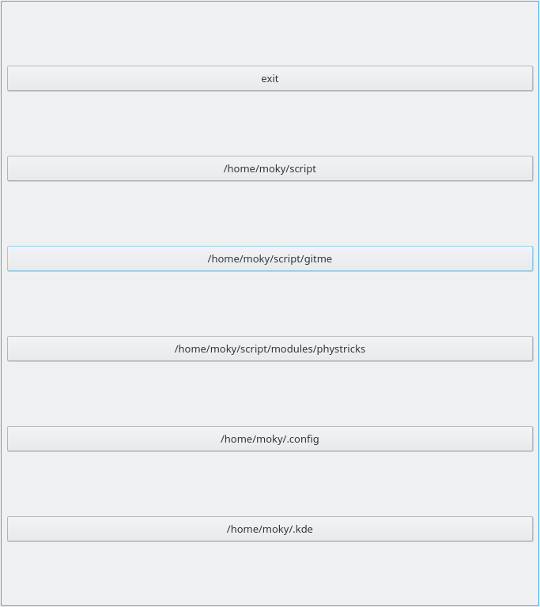
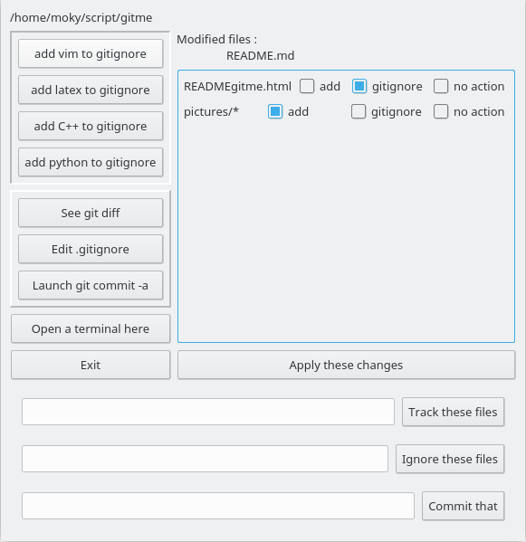

# GITME: did you did your 'git commit' today ?

gitme recursively parses your home directory and analyse the result of `git status` on each directory containing `.git`. It warns you when a directory needs a `git commit` and give a list of the untracked files. Proposes you to add them in `.gitignore`.

A small graphical interface is written in Qt.

## Installation and compilation

* Download 

        git clone https://github.com/LaurentClaessens/gitme

* Compile 

        make gitme

* run 

        ./gitme

## What it does 

A list of directories that are not clean git repository (untracked or modified files) is displayed. Clicking on one of them opens a dialog window that helps you to 
  - add files in .gitignore
  - track files
  - make a 'git commit -a'
  - see git diff
  - ...

## Very basic graphical interface

Here is an example of the main window listing the forgotten directories awaiting for some love :

Here is the window helping with git in the repository `gitme`. You see that `README.md` is modified and that there are new files that I can add to `.gitignore` or track. 

We can also

- automatically add to `.gitignore` files corresponding to Vim, LaTeX, C++ or Python.
- see the `git diff`
- open a terminal
- edit `.gitignore`
